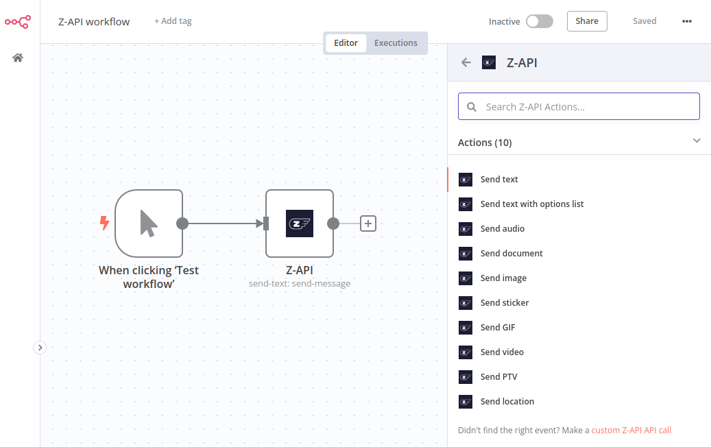

# n8n-nodes-zapi

This is an n8n community node. It lets you use Z-API in your n8n workflows.

Z-API is a service that provides an API enabling interaction with your WhatsApp through a API, along with webhooks to notify you about interactions with your number.

[n8n](https://n8n.io/) is a [fair-code licensed](https://docs.n8n.io/reference/license/) workflow automation platform.

- [Installation](#installation)
- [Operations](#operations)
- [Credentials](#credentials)
- [Resources](#resources)

## Installation

Follow the [installation guide](https://docs.n8n.io/integrations/community-nodes/installation/) in the n8n community nodes documentation.

## Operations

  

The following operations are supported by the Z-API node:

### Messages

#### Send Message
- [x] Send text
- [x] Send image
- [x] Send sticker
- [x] Send GIF
- [x] Send audio
- [x] Send video
- [x] Send PTV
- [x] Send documents
- [ ] Send link
- [x] Send location
- [ ] Send contact
- [ ] Send multiple contacts
- [ ] ~~Send text with action buttons~~ (unavailable)
- [ ] ~~Send text with buttons texto~~ (unavailable)
- [ ] ~~Send image with buttons botões~~ (unavailable)
- [x] Send list of options

#### Manage Message
- [ ] Send reaction
- [ ] Remove reaction
- [ ] Delete message
- [ ] Read message
- [ ] Forward message
- [ ] Pin message
- [ ] Unpin message

#### Products
- [ ] Send product
- [ ] Send catalog
- [ ] Send order approval
- [ ] Send order status update
- [ ] Send payment status update

#### Events
- [ ] Send event
- [ ] Edit event
- [ ] Respond to event

#### Polls
- [ ] Send poll
- [ ] Send poll vote

## Credentials

To use this node, you need to authenticate with the Z-API service. Follow these steps:

1. **Sign Up**: Create an account on [Z-API](https://www.z-api.io/).
2. **Create an Instance**: After signing up, create an instance in the Z-API dashboard. Each instance will have its own ID and Token.
3. **Get ID and Token**: Go to your instance settings in the admin panel to find your ID and Token.
4. Navigate to the "Security" tab and find the "Client Token" module.
5. Click "Configure Now" to generate a token. Initially, the token will be disabled to avoid disruptions.
6. Activate the token in the Z-API dashboard.
7. **Add Credentials to n8n**: In n8n, go to the credentials section and add new credentials for Z-API. Use the ID and Token from your Z-API instance and the Client Token from your account.

## Resources

* [n8n community nodes documentation](https://docs.n8n.io/integrations/community-nodes/)
* [Z-API documentation](https://developer.z-api.io/)
